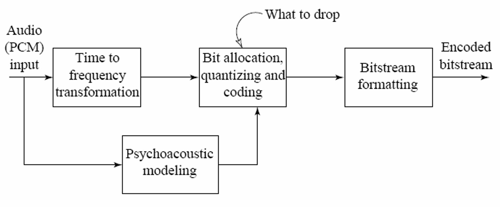

# Compression-of-an-Audio-Signal-Using-MPEG-1
# MPEG-1 Perceptual Audio Compression – TP4 Summary

## Overview

This project is a practical exploration of audio compression techniques inspired by the MPEG-1 Layer III (MP3) standard. The goal is to compress audio data efficiently by leveraging psychoacoustic principles—reducing the bitrate while preserving perceived audio quality.

The diagram below illustrates the encoding pipeline used in MPEG-1-based compression:

## Processing Chain Description

1. **Audio (PCM) Input**  
   The input is a standard uncompressed audio signal in PCM format (e.g., WAV file). This signal is passed through two processing paths in parallel:
   
   - **Time to Frequency Transformation**
   - **Psychoacoustic Modeling**

2. **Time to Frequency Transformation**  
   The signal is segmented into overlapping frames and transformed using the Short-Time Fourier Transform (STFT), producing a time-frequency representation of the signal.

3. **Psychoacoustic Modeling**  
   Based on human hearing perception, a model estimates which frequency components are more or less perceptible. It determines:
   - Signal-to-Mask Ratio (SMR)
   - Components that can be dropped without audible loss

4. **Bit Allocation, Quantizing, and Coding**  
   Using the SMR map:
   - Bits are distributed unequally to frequency bins (more to perceptible components)
   - Each bin is quantized according to its allocated bits
   - Unimportant components (masked or low energy) are dropped

5. **Bitstream Formatting**  
   The quantized data is packed into a binary format suitable for storage or transmission.

6. **Encoded Bitstream**  
   The output is a compressed binary stream that can be decoded by a compatible decoder to reproduce a high-fidelity approximation of the original signal.

## Key Features

- **Perceptual Compression**: Exploits auditory masking and threshold phenomena.
- **Non-uniform Bit Allocation**: Improves efficiency compared to uniform quantization.
- **Greedy Algorithm**: Allocates bits where SMR is highest.
- **Reconstruction Support**: Inverse STFT and dequantization recover the time-domain signal.

## Tested Audio Examples

Audio files used for testing include:
- Suzanne Vega – Tom's Diner (voice)
- Daft Punk – Around the World (electronic music)
- Orchestral recording (complex dynamics)

Each was tested at various target bitrates (64 kbps to 396 kbps) using both:
- **Uniform allocation**
- **Psychoacoustic bit allocation**

## Observations

- **Low bitrate (64–96 kbps)**: Metallic artifacts, loss of clarity.
- **Medium bitrate (128–192 kbps)**: Fundamental components preserved, some degradation in texture.
- **High bitrate (256–396 kbps)**: Transparent reconstruction; spectrogram closely matches the original.

## Possible Improvements

- Adaptive masking threshold based on signal characteristics
- Dynamic STFT parameters
- Integration of entropy coding (e.g., Huffman)
- More advanced psychoacoustic models

